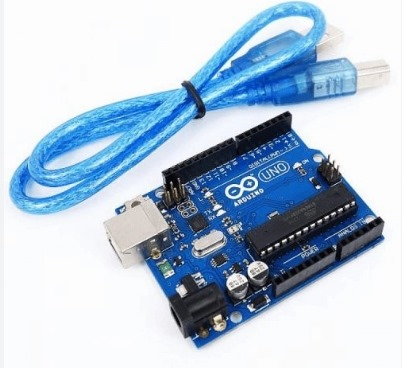
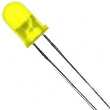
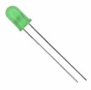
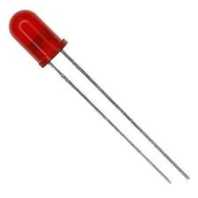
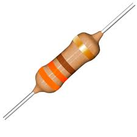
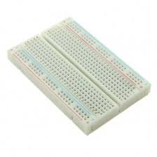

# Projeto - Semáforo Offline

Foi desenvolvido um semáforo que funciona offline, as configurações de tempo dele são:

- 6 segundos no vermelho
- 2 segundos no amarelo
- 2 segundos no verde
- +2 segundos no verde (simulando um tempo adicional para pedestres terminarem a travessia)
- 2 segundos no amarelo

Além disso, nos 2 primeiros segundos que ele está verde você tem um buzzer que realiza um som para informar possíveis pedestres deficientes visuais que eles podem atravessar.

## Montagem Fisica
Seguem fotos e vídeos da montagem:


[Assista ao vídeo](https://drive.google.com/file/d/1WFbPd79on9XLgic3p6_tg-3fnYk6NPK5/view?usp=sharing)

## Componentes Utilizados

<div align="center">
    
| **Número da Peça** | **Nome**                                  | **Descrição**                                    | **Quantidade** | **Imagem**                                                              | **Finalidade**                           |
|--------------------|-------------------------------------------|-------------------------------------------------|----------------|-------------------------------------------------------------------------|-----------------------------------------|
| ELEC-001           | Arduino UNO + Cabo                        | Microcontrolador                                | 1              | <sub>Imagem X - Imagem do material de uso</sub>  <sup>Fonte: Material produzido por Eletrogate.</sup> | Microcontrolador principal              |
| LED-001            | LED Amarelo                               | Diodo emissor de luz (amarelo)                  | 1              | <sub>Imagem X - Imagem do material de uso</sub>  <sup>Fonte: Material produzido por Eletrogate.</sup> | Indicação visual                        |                |
| LED-003            | LED Verde                                 | Diodo emissor de luz (verde)                    | 1              | <sub>Imagem X - Imagem do material de uso</sub>  <sup>Fonte: Material produzido por Eletrogate.</sup> | Indicação visual                        |
| LED-004            | LED Vermelho                              | Diodo emissor de luz (vermelho)                 | 1              | <sub>Imagem X - Imagem do material de uso</sub>  <sup>Fonte: Material produzido por Eletrogate.</sup> | Indicação visual                        |
| RES-001            | Resistor 330 Ohms                         | Controle de corrente                            | 4              | <sub>Imagem X - Imagem do material de uso</sub>  <sup>Fonte: Material produzido por Curto Circuito.</sup> | Limitação de corrente                   |
| PCB-001            | Protoboard                                | Placa de prototipagem                           | 1              | <sub>Imagem X - Imagem do material de uso</sub>  <sup>Fonte: Material produzido por Eletrogate.</sup> | Para montagem temporária de circuitos   |
| ELEC-004           | Buzzer                                    | Emissão de som                                  | 1              | <sub>Imagem X - Imagem do material de uso</sub>  <sup>Fonte: Material produzido por Baú da Eletrônica.</sup> | Para sinalização sonora                 |

</div>

---

Esses foram os componentes utilizados, e eles foram conecatados através de fios jumpers, ou seja, fios condutores de energia elétrica. No geral, foram utilizados fios do tipo macho-macho, mas nas conexões com os LEDs nós utilizamos o fio macho-femea.

No link a seguir temos um desenho inicial feito no tinkercad antes do inicio da montagem do projeto: [Projeto Tinkercad](https://www.tinkercad.com/things/cZYSIxYifaA-exquisite-duup/editel?returnTo=https%3A%2F%2Fwww.tinkercad.com%2Fdashboard&sharecode=Yu-CArsj7J88r22u3wnqMmULubZeYqI5sMhXP8YrbuI).

## Código

O código utilizado no arduino foi:

```
int redLed = 13;      // LED vermelho conectado na porta 13
int yellowLed = 12;   // LED amarelo conectado na porta 12
int greenLed = 11;    // LED verde conectado na porta 11
int buzzer = 9;       // Buzzer conectado na porta 9

void setup() {
  pinMode(redLed, OUTPUT);
  pinMode(yellowLed, OUTPUT);
  pinMode(greenLed, OUTPUT);
  pinMode(buzzer, OUTPUT);
}

void loop() {
  // Etapa do sinal vermelho
  digitalWrite(redLed, HIGH);    
  delay(6000); // Mantém aceso por 6 segundos
  digitalWrite(redLed, LOW);

  // Etapa do sinal amarelo
  digitalWrite(yellowLed, HIGH);
  delay(2000);// Mantém aceso por 2 segundos
  digitalWrite(yellowLed, LOW);

  // Etapa do sinal verde
  digitalWrite(greenLed, HIGH);
  tone(buzzer, 1000);// Toca o buzzer em 1000 Hz
  delay(2000);// Mantém aceso por 2 segundos

  // Tempo adicional para travessia de pedestres
  noTone(buzzer);// Para o som do buzzer
  delay(2000);// Mantém o LED verde por mais 2 segundos
  digitalWrite(greenLed, LOW);  

  // Etapa do sinal amarelo antes de retornar ao vermelho
  digitalWrite(yellowLed, HIGH);
  delay(2000);// Mantém aceso por 2 segundos
  digitalWrite(yellowLed, LOW);
}

```

## Vídeo Funcionamento

[Assista ao vídeo](https://drive.google.com/file/d/1jigBenZLhAuCetsNSoBfEZrK9gfPLIBv/view?usp=sharing)

## Avaliação

### Avaliador: Paulo Henrique

| Critério                                                                                                 | Contempla (Pontos) | Contempla Parcialmente (Pontos) | Não Contempla (Pontos) | Observações do Avaliador |
|---------------------------------------------------------------------------------------------------------|--------------------|----------------------------------|--------------------------|---------------------------|
| Montagem física com cores corretas, boa disposição dos fios e uso adequado de resistores                | Até 3              | Até 1,5                            | 0                        |    3                       |
| Temporização adequada conforme tempos medidos com auxílio de algum instrumento externo                  | Até 3              | Até 1,5                          | 0                        |  3                         |
| Código implementa corretamente as fases do semáforo e estrutura do código (variáveis representativas e comentários) | Até 3              | Até 1,5                          | 0                        |     3                      |
| Extra: Implmeentou um componente de liga/desliga no semáforo e/ou usou ponteiros no código | Até 1              |  Até 0,5                         | 0                        |                 1          |
|  |                                                             |  | |**Pontuação Total: 10**|
